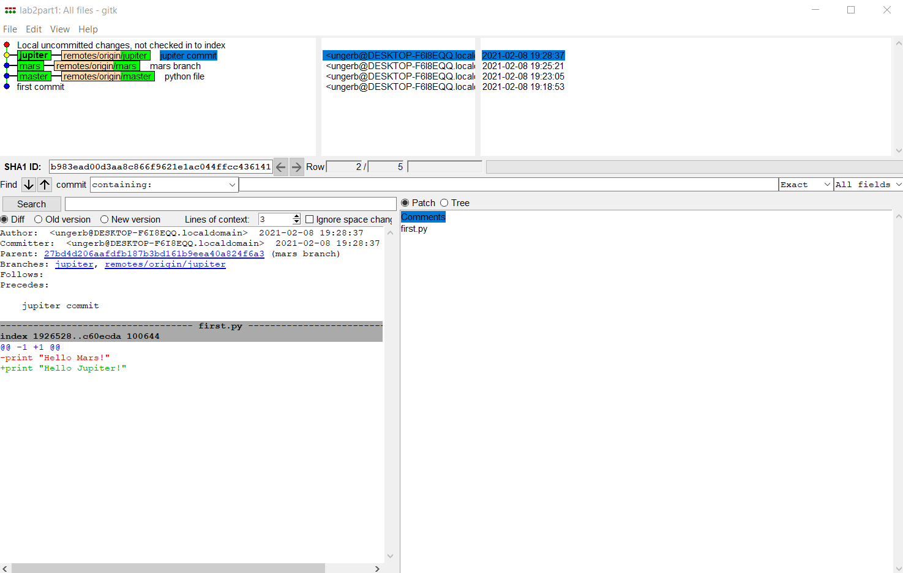
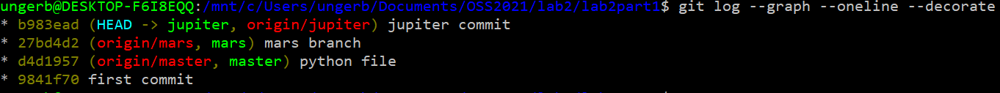
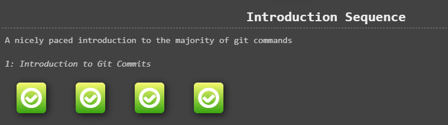
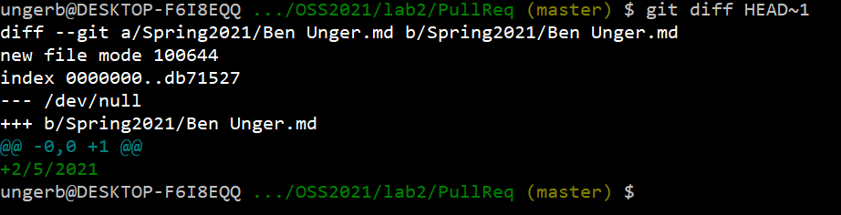
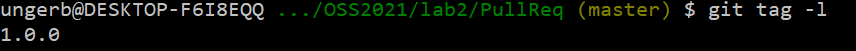

# Part 1

### lab2part1:
https://github.com/BreadGarLick/lab2part1

### gitk:

### git log:

# Part 2

### Spoon-Knife fork:

https://github.com/BreadGarLick/Spoon-Knife

### Learn Git Branching Game:

# Part 3

### My fork of PullReq

https://github.com/BreadGarLick/PullReq

### git diff

When I run `git diff`, there is no output, as everything is up to date and pulled/pushed. Below is `git diff HEAD~1`. We can see that on the pull request, we didn't have my file and the file of another student included. This is why there are tow new files listed.

### git tag

### Project ideas

Unfortunately, I was unable to get to this part during my lab, so I had to do this part solo. I've added my ideas to the forked repo.

https://github.com/BreadGarLick/OSSProjectIdeas
